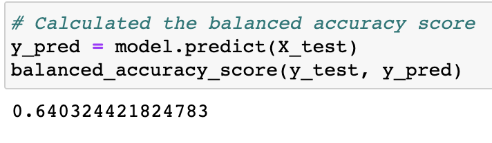

# Credit_Risk_Analysis
Supervised Machine Learning project for UT Austin Data Analysis &amp; Visualization Program

## Overview

The purpose of this project was to compare the efficacy of various methods of performing logistic regression on a credit risk analysis dataset to predict whether a given loan was high or low risk. We first experimented with several resampling methods, including naive random oversampling, SMOTE oversampling, cluster centroid undersampling, and SMOTEENN combination resampling. Then we experimented with two different algorithms - a Balanced Random Forest Classifier and Easy Ensemble AdaBoost Classifier. We evaluated the results by examining the balanced accuracy score, confusion matrix, and imbalance classification report for each method.

## Results
### Naive Random Oversampling
- Accuracy: 0.64
- Precision:  0.01
- Recall: 0.66

 

 

### SMOTE Oversampling
- Accuracy: 0.65
- Precision:  0.01
- Recall: 0.61

 

 

### Cluster Centroid Undersampling
- Accuracy: 0.54
- Precision:  0.01
- Recall: 0.69

 

 

### SMOTEENN Combination Resampling
- Accuracy: 0.64
- Precision:  0.01
- Recall: 0.66

 

 

### Balanced Random Forest Classifier
- Accuracy: 0.75
- Precision:  0.03
- Recall: 0.62

 

 

### Easy Ensemble AdaBoost Classifier
- Accuracy: 0.93
- Precision: 0.09
- Recall: 0.92

 

 

## Summary

We can draw several conclusions from these results. First, every method has a total precision score of 0.99, which makes sense given that the dataset is large and there are only a few high risk loans relative to the number of low risk loans and the models will all have a large number of true negatives relative to false negatives. The best assessment of the algorithm's precision will actually be its precision in detecting only high risk instances. Each model has a precision less than 0.1, which means that they all detect a large number of false positives. The Easy Ensemble Classifier performs the best in this regard, with a precision of 0.09, which minimizes false positives.

The most important factor, however, is recall. Recall is the proportion of high risk loans which were identified. Since only a small number of loans are high risk, it is critical to identify as many of these as possible. The algorithm's recall is the measure of its ability to do this. Again, the Easy Ensemble Classifier performed the best.

Lastly, the accuracy represents the proportion of predictions which were accurate overall, true or false. The accuracy of these methods varies from 54% to 93%, with the Easy Ensemble Classifier again coming in the lead.

The ensemble methods held a distinct advantage over the singular methods, and both the Random Forest Classifier and Easy Ensemble Classifier outperformed the others. The Easy Ensemble method, though, would be the best to use in this case. It correctly predicted 93 out of 101 high risk cases, only letting 8 slip through undetected. It also only incorrectly flagged 983 loans as high risk that should in fact have been low risk. Compared to the other methods, some of which failed to detect up to 39 high risk loans or flagged as many as 10341 false positives, the Easy Ensemble Classifier is a clear winner.

